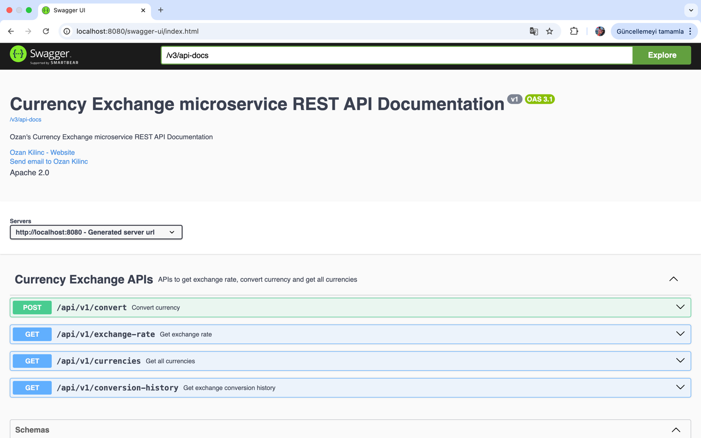
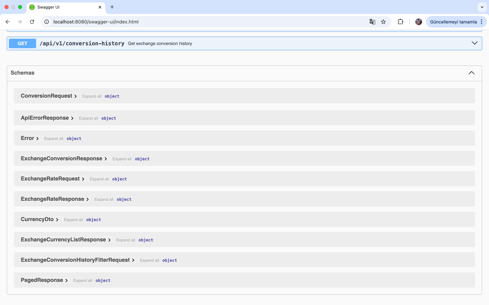
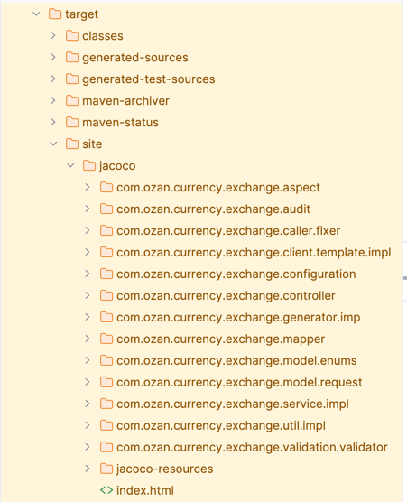
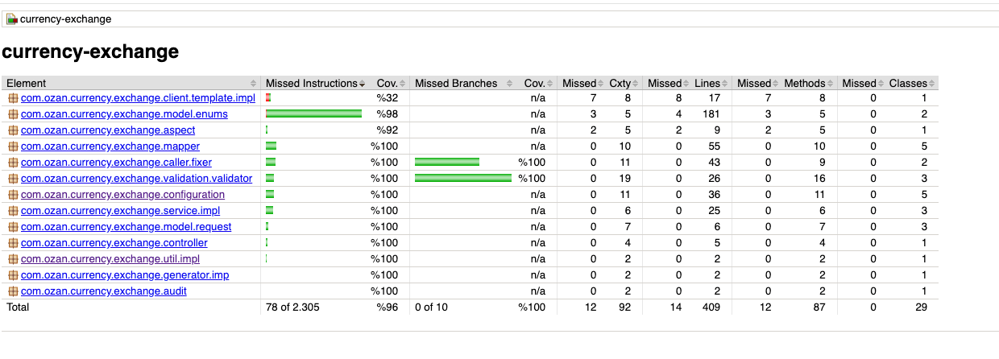

# Currency Exchange Application

> ### Spring Boot + Spring Data + Open API(Swagger) + Caffeine Cache + H2 Database

---
### 📖 Overview

This project is a Foreign Currency Exchange application. New technologies have been used within the scope of the project. 
The application can be run quickly without requiring any additional dependencies. 
The technologies used were chosen to avoid dependency requirements. If needed, making it production-ready would be very simple. 
For example, Caffeine Cache could be quickly replaced with Redis. 
It has been written following SOLID principles. An external service has been integrated to fetch exchange rates, enabling fast conversion operations. 
Currencies in the project have been designed to be compatible with the external service.

**The application includes four main endpoints:**
<ul style="list-style-type:disc">
      <li>Currency Exchange API: Retrieves all available currencies</li>
      <li>Exchange Rate API: Retrieves the exchange rate between specified currencies.</li>
      <li>Convert Currency API: Converts a specified amount from one currency to another and provides a unique transaction ID.</li>
      <li>Exchange Conversion History API: Retrieves the history of currency conversions based on transaction IDs or date ranges.</li>
</ul>

---
### Prerequisites
- Java 17
- Maven

---
### Technologies

- Java 17
- Spring Boot 3.4.3
- Restful API
- Open Api (Swagger)
- Maven
- Junit5
- Mockito
- Integration Tests
- Postman
- H2 Database (In-Memory)
- Spring Boot Actuator
- Caffeine Cache
- Jacoco (Code Coverage)

---
### Postman

```
Import postman collection under postman_collection folder
```
---
### Open Api (Swagger)

API documentation is available via Swagger UI. Once the application is running, you can access it at:
> **Link : http://localhost:8080/swagger-ui/index.html**

<details>
<summary>Click here to show <b>Swagger UI</b></summary>
    <p> To See Swagger UI APIs </p>
    
    <p> To See Swagger UI Schemas </p>
    
</details>

---
### Running the Application
#### Using Maven
1. Navigate to the project directory.
2. To compile and build the Maven project and manage its dependencies: `mvn clean install`
3. Run the application:`mvn spring-boot:run`

---
### Jacoco (Code Coverage)
To view the code coverage report in the application, you can use the following commands:
1. `mvn clean install`
2. `mvn clean verify`

After this process, you can access the code coverage report in the `target/site/jacoco/index.html directory.`

<details>
<summary>Click here to show <b>jacoco details</b></summary>
    <p> To See Jacoco Target Folder </p>
    
    <p> To See Jacoco Report </p>
    
</details>

---
### Contributors

- [Ozan Kılınç](https://github.com/oznklnc)